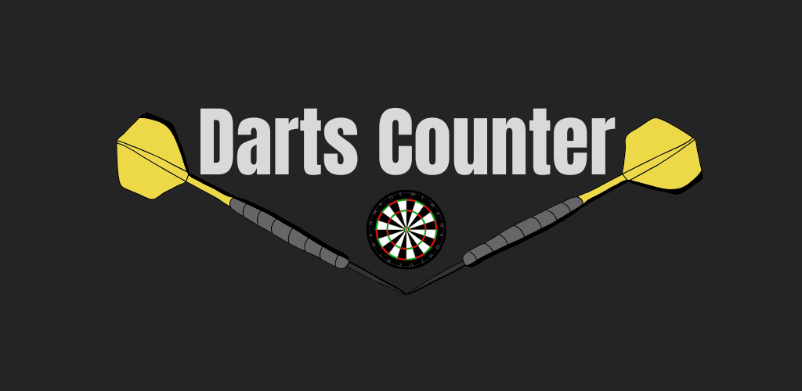

<!-- <h1 align="center">Darts Counter</h1> -->

<p align="center">

  

  18.18.2-brightgreen">

</p>

<p align="center">
  <a href="#dart-about">About</a> &#xa0; | &#xa0; 
  <a href="#house_with_garden-platforms">Platforms</a> &#xa0; | &#xa0; 
  <a href="#rocket-technologie">Technologies</a> &#xa0; | &#xa0;
  <a href="#iphone-mobile">Mobile</a> &#xa0; | &#xa0;
  <a href="#white_check_mark-requirements">Requirements</a> &#xa0; | &#xa0;
</p>

<br>

## :dart: About

Counting points in darts couldn't be easier. Add players and mark their points on the dartboard in the app.

- add points by marking the fields on the dartboard
- edit points using keyboard (if you prefer)
- information about remaining movements
- round counter


## :house_with_garden: Platforms
| Platform | Available |
|----------|-------|
| WEB | :white_check_mark: [Link](https://darts.webkor.pl/) |
| PWA | :white_check_mark: [Link](https://darts.webkor.pl/) |
| Google Play | :white_check_mark: [Link](https://play.google.com/store/apps/details?id=pl.webkor.darts.app&hl=pl&gl=US&pli=1)|
| Apple strore | :x: |
| Windows | :x: |
| Linux | :x: |

## :rocket: Technologies

- [Vue 3](https://vuejs.org/)
- [Vue Router 4](https://router.vuejs.org/)
- [Vuetify 3](https://vuetifyjs.com/en/)
- [Capacitor 5](https://capacitorjs.com/)

## :iphone: Mobile

1. First usage
```bash
# Install dependencies
$ npm install @capacitor/core @capacitor/cli

# Init capacitator
$ npx cap init [name] [id] --web-dir=dist
```

2. Build the Web App
```bash
# Build app
$ npm run build
```

3. Install the native platforms you want to target
```bash
$ npm i @capacitor/ios @capacitor/android
$ npx cap add android
$ npx cap add ios
```

4. Install the native platforms you want to target
```bash
$ npm i @capacitor/ios @capacitor/android
$ npx cap add android
$ npx cap add ios
```

5. You can test your app on virtual device
```bash
$ npx cap run android
```

5. Open your project in android studio
```bash
$ npx cap open android
```
[More info](https://capacitorjs.com/docs/android)

5. Build your apk file in Android Studio project. 

Build -> build Bundle(s) / APK(s) -> Build APK(s) (for tests)
Build -> Generate signed bundle / APK -> Build APK(s) (for production apk)

You can find builded apk's files in android -> app -> output -> debug (for tests)
android -> app -> release (for production)

## :white_check_mark: Requirements

For Web & PWA

- NodeJS > 18.18.2

For Android

- Installed Android Studio
- Set JAVA_HOME global variable to: `C:\Program Files\Android\Android Studio\jbr`
- Set Path global variable to: `%JAVA_HOME%\bin`

<br><br>
Made with :heart: by Webkor Adrian Korzan

&#xa0;

<a href="#top">Back to top</a>
